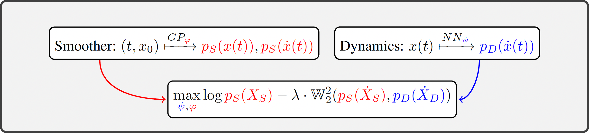

# Distributional Gradient Matching for Learning Uncertain Neural Dynamics Models

[**Requirements**](#requirements)
| [**Training**](#training)
| [**Results**](#results)
| [**Contributing**](#contributing)

This repository is the official implementation of [Distributional Gradient Matching for Learning Uncertain Neural Dynamics Models](https://arxiv.org/abs/2106.11609). 

<p align="center">

</p>


## Requirements

To install requirements:

```setup
pip install -r requirements.txt
```

> We build our code using [JAX](https://github.com/google/jax). The code of the algorithm is in the folder [`dgm`](./dgm).

## Training

Examples how to train the model from the paper are in the folder [`examples`](./examples). To train e.g. Double Pendulum model on 
multiple trajectories, go to folder [`examples/non_parameteric/multiple_trajectories`](./examples/non_parameteric/multiple_trajectories) and run:

```train
python double_pendulum.py 
```

## Results

Our model achieves the following Log-Likelihood score on different datasets:


| Dataset            | Single Trajectory [LL] | Multiple Trajectories [LL] |
| ------------------ |---------------- | -------------- |
|  [`Lotka Volterra`](https://en.wikipedia.org/wiki/Lotka%E2%80%93Volterra_equations)  |     1.96 &pm; 0.21         |     1.81 &pm; 0.08       |
|  [`Lorenz`](https://en.wikipedia.org/wiki/Lorenz_system)  |     −0.57 &pm; 0.11        |      −2.18 &pm; 0.76       |
|  [`Double Pendulum`](https://en.wikipedia.org/wiki/Double_pendulum)  |     2.13 &pm; 0.14         |      1.86 &pm; 0.05       |
|  [`Quadrocopter`](https://charlestytler.com/category/quadcopter/) |     0.64 &pm; 0.07         |      -0.54 &pm; 0.36      |


## Contributing

If you would like to contribute to the project please reach out to [Lenart Treven](mailto:trevenl@ethz.ch?subject=[DGM]%20Contribution%20to%20DGM) or [Philippe Wenk](mailto:wenkph@ethz.ch?subject=[DGM]%20Contribution%20to%20DGM). If you found this library useful in your research, please consider citing.
```
@article{treven2021distributional,
  title={Distributional Gradient Matching for Learning Uncertain Neural Dynamics Models},
  author={Treven, Lenart and Wenk, Philippe and Dörfler, Florian and Krause, Andreas},
  journal={Advances in Neural Information Processing Systems},
  year={2021}
}
```